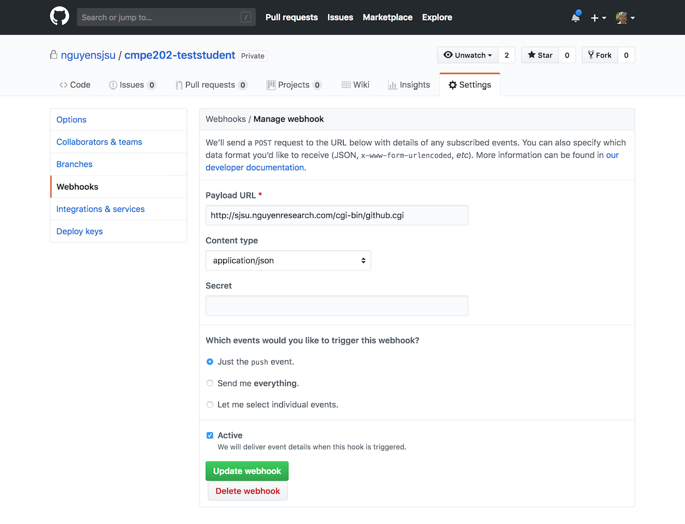

# Starbucks Design Note

Design Details:

Design Patterns Used

## Creational Design Pattern
#   Singleton:
	
Singleton pattern is implemented when we want to make sure, only a single instance of an object is returned. In our application we have used this for 	Device. To design a singleton class we make the constructor private and provide a static getInstance method that returns object of this singleton class.

## Structural Design Pattern

# 	Composite:
		
 The intent of a composite is to “compose” objects into tree like structure and ask each node in the tree structure to perform a task. Add Card has a composite pattern implemented where Card Number, Spacer and Cvv have been added as subcomponents. 
  
Role:
  
 IDisplayComponent acts as the parent interface and has display() and addSubComponent(IDisplayComponent c) methods.
 AddCard acts as Composite and has children/Leaf added to it.
 CardNumber, Spacer and Cvv acts as Leaf components. 

#	Decorator:

Decorator pattern allows a user to add new functionality to an existing object without altering its structure. This type of design pattern comes under structural pattern as this pattern acts as a wrapper to existing class. We are using Decorator pattern to decorate the display. In our application we have overridden display() method for this.
	
Role:

IndentationDecorator is the parent abstract class which is implementing IScreen display() method. IndentationDecorator has a constructor which takes IScreen object.
IndentaionDecorator class is extended by LeftIndentationDecorator and CenteredIndentationDecorator. These decorators calls the display() method of IScreen internally and wraps their implementation over it. 

In the appcontroller class, the MycardsPay have been instantiated such that it is wrapped inside CenteredIndentationDecorator. Later when the display method of Decorator class is called, it first calls the display of MyCardsPay internally and does the indentation on top of the output produced by the internal function. 
Left and Right Screens alignment has been implemented using Decorator pattern.

# 	Proxy:

In proxy pattern, we create object having original object to interface its functionality to outer world.
Device class has been used as a proxy for AppController. All the requests coming to the AppController first goes through Device. And the user would not be able to reach AppController until authorized. So Proxy acts as a firewall between user and the actual class. 

## Behavioral Pattern

# Chain of Responsibility

Chain of responsibility pattern is used to achieve loose coupling in software design where a request from the client is passed to a chain of objects to process them. Later, the object in the chain will decide themselves who will be processing the request and whether the request is required to be sent to the next object in the chain or not.

PinScreen and AddCard screen has this pattern Implemented.

Role:

 ITouchEventHandler is the interface used. ITouchEventHandler has touch(int x, int y) method to handle the event and setNext(ITouchEventHandler c) method to pass the control. 
 
In AddCard Screen, CardNumber is the first component added. The CardNumber checks if it can handle the touch event, if it can, it will process, else it passes the event to the NextHandler i.e Cvv. Cvv check if it can handle it, else it will pass to Spacer and Keypad and so on. All the components that wants to be a part of this chain should implement the ITouchEventHandler

 
# Command

The Command pattern is a part of the GoF‘s formal list of design patterns. Simply put, the pattern intends to encapsulate in an object all the data required for performing a given action (command), including what method to call, the method's arguments, and the object to which the method belongs.

In our implementation, the command pattern requires implementing following components: the Command (IMenuCommand), the Receiver(IMenuReceiver), the Invoker(IMenuInvoker).

IMenuInvoker has setCommand(IMenuCommand cmd) and invoke() method. In the starbucks application, the menu items [A],[B],[C],[D],[E] represents the Menu item. Each item is linked to a invoker, command and receiver. 

IMenuCommand has setReceiver and execute() method. A command is an object whose role is to store all the information required for executing an action, including the method to call, the method arguments, and the object (known as the receiver) that implements the method.

IMenuReceiver has doAction() method. A receiver is an object that performs a set of cohesive actions. It's the component that performs the actual action when the command's execute() method is called. 

In our application each item has a Command associated to it. When the execute() method of the MenuCommand is called, It internally calls doAction() method of the receiver, which changes the frame contents in our case. 

# Observer
	
Observer pattern is used when there is one-to-many relationship between objects such as if one object is modified, its dependent objects are to be notified automatically.

Role
 	
For AddCard screen, Keypad acts as the Subject and CardNumber and CVV as the Observers. When the keypad notifies the Observers, the keyEventUpdate method of observers is called. Each observers receives the notification and handles the event accordingly.

# State

In State pattern a class behavior changes based on its state. In State pattern, we create objects which represent various states and a context object whose behavior varies as its state object changes.	

Role:

IPinState is the interface which is implemented by all 6 Pin states (noPin, OnePin, TwoPin, ThreePin, FourPin, FivePin, SixPin)
PinEntryMachine is the context class and it maintains references to concrete state object which may be used to define current state of object. It delegates state-specific behavior to different State objects.
		
# Strategy
In Strategy pattern, a class behavior or its algorithm can be changed at run time. In Strategy pattern, we create objects which represent various strategies and a context object whose behavior varies as per its strategy object. The strategy object changes the executing algorithm of the context object.

Role:

IOrientationStrategy is the orientationStarategy Interface used to set the Orientation at run time. This interface is implemented by concrete strategy classes LandscapeStrategy and PortraitStartegy. The individual screens can change their behavior by calling landscape() or portrait() methods.

		
# Class Diagram for 4 and 6 Pin Authentication.  

# Class Diagram for Centered and Landscape. 

 
# Class Diagram for AddCard. 

 

# Sequence Diagram on Centered and Landscape. 

# Starbucks Mobile App (Text UI) Project

## Submission for Grader

To get your code graded, commit your stable changes to the *master* branch and then request the a grader test at the following:

* http://sjsu.nguyenresearch.com/cgi-bin/grader.cgi

Type in your *repo* name and click "submit".  I.E. cmpe202-teststudent.  It may take up to 5-10 minutes as the Grader picks up your request.  You can check your results at the following location.

* http://sjsu.nguyenresearch.com/grader

## Slack Messages from Grader

The Grader will post a message once your test results are ready.  The message will be in the *#starbucks* channel.  An example message looks like:

<pre>
Starbucks APP [8:50 PM]
Tests: 72% - Comments:  0 - Bugs: 8 - Smells: 22 - http://sjsu.nguyenresearch.com/grader/cmpe202-teststudent
</pre>

## Grader Test Results

Grader results are posted in the following files:

* tests.html
* bugs.html
* codesmells.txt

## Running Local Tests

If you hve Gradle 4.9 installed locally, you can run the following Makfile rules to get local results.  Please note that the JUnit tests will be only the ones locally available and not the full set of tests the Grader uses.

<pre>
test:
    gradle test

spotbugs:
    gradle spotbugsMain

codesmells:
    gradle smartsmells
</pre>

## Setting Up a GitHub Webhook

You can also configure your GitHub Repo to automatically submit a Grader request upon a commit to your *master* branch.  Set this up as follows:

* Webhook URL:  http://sjsu.nguyenresearch.com/cgi-bin/github.cgi
* Content Type: application/json
* Event Trigger: push 

